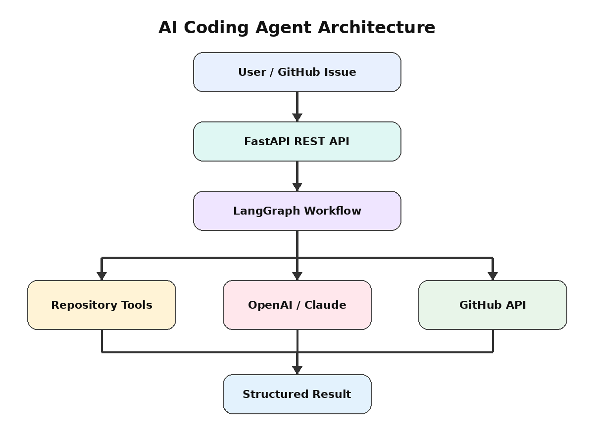
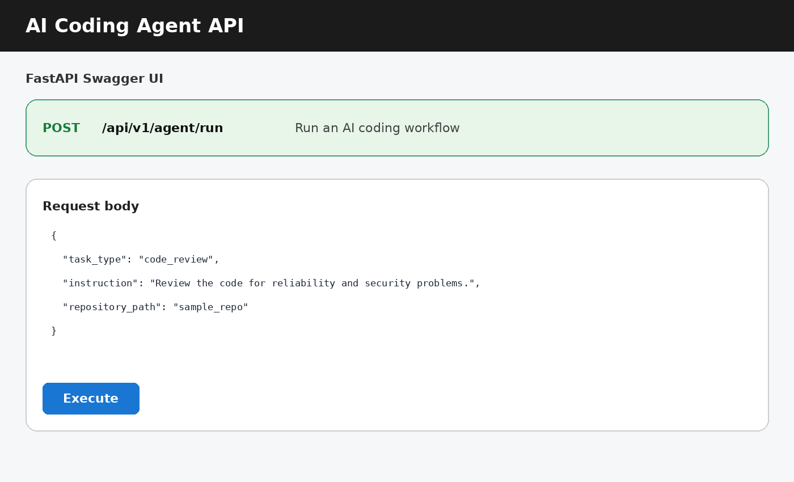
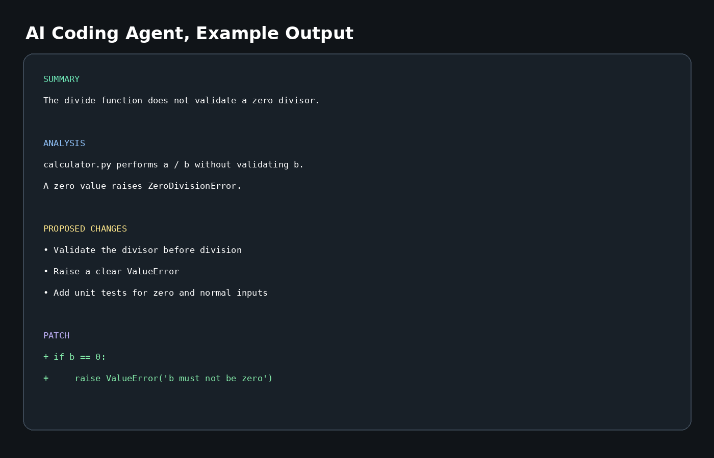

# AI Coding Agent for Automated Software Engineering

[](https://www.python.org/)
[](https://fastapi.tiangolo.com/)
[](https://langchain-ai.github.io/langgraph/)
[](https://www.docker.com/)
[](https://github.com/ParisaArbab/ai-coding-agent/actions)
[](LICENSE)
[](#project-status)

An AI software engineering agent that analyzes repositories and GitHub issues using LLM-powered workflows. It reduces the manual effort required for repository understanding, code review, bug triage, documentation, fix planning, and protected pull request preparation.

## Features

- ✅ Repository question answering
- ✅ AI-assisted code review
- ✅ Bug triage and root-cause analysis
- ✅ Documentation generation
- ✅ GitHub issue analysis
- ✅ Code-fix and patch suggestions
- ✅ Protected pull request workflow components
- ✅ OpenAI, Claude, and local mock modes
- ✅ MCP repository tools
- ✅ Docker deployment
- ✅ Filesystem and GitHub write safety controls
- ✅ Unit tests and GitHub Actions CI

## Architecture Diagram



```text
User or GitHub Issue
        ↓
     FastAPI
        ↓
 LangGraph Workflow
   ↙      ↓       ↘
Repository  LLM    GitHub API
 Tools    Provider  Service
   ↓        ↓          ↓
Local Code OpenAI/Claude Proposed Fix or PR Plan
```

## Tech Stack

| Area | Technologies |
|---|---|
| Language | Python 3.11+ |
| API | FastAPI, Pydantic, Uvicorn |
| Agent orchestration | LangGraph |
| LLM integration | LangChain, OpenAI, Anthropic Claude |
| Tool protocol | Model Context Protocol, MCP |
| Repository integration | GitHub REST API, HTTPX |
| Deployment | Docker, Docker Compose |
| Testing and quality | Pytest, Ruff, MyPy, GitHub Actions |

## Skills Demonstrated

- Python and backend development
- Software engineering and modular architecture
- REST API design with FastAPI
- AI agents and LangGraph workflows
- LangChain tool development
- OpenAI and Claude integration
- Prompt engineering and structured outputs
- GitHub API integration
- Model Context Protocol, MCP
- Secure filesystem handling
- Human-in-the-loop workflow design
- Unit testing and API testing
- CI/CD with GitHub Actions
- Docker containerization
- Error handling and configuration management

## Project Structure

```text
ai-coding-agent/
├── app/
│   ├── agents/          # LangGraph workflow, prompts, output parser
│   ├── api/             # FastAPI routes
│   ├── core/            # Settings, logging, dependencies, security
│   ├── llm/             # OpenAI, Claude, and mock providers
│   ├── models/          # Pydantic request, response, and state models
│   ├── services/        # Repository and GitHub API services
│   ├── tools/           # LangChain repository tools
│   └── main.py          # FastAPI application entry point
├── mcp_server/          # MCP server and repository tools
├── evaluation/          # Lightweight evaluation script and results
├── examples/            # Example API request and output
├── tests/               # Unit, security, repository, and API tests
├── docs/
│   ├── images/          # Architecture and API screenshots
│   └── architecture.md
├── workspace/           # Safe root for local repositories
├── .github/workflows/   # CI pipeline
├── Dockerfile
├── docker-compose.yml
├── requirements.txt
├── pyproject.toml
└── LICENSE
```

## Installation

### Option 1, install with `requirements.txt`

```bash
git clone https://github.com/ParisaArbab/ai-coding-agent.git
cd ai-coding-agent

python -m venv .venv
source .venv/bin/activate
pip install -r requirements.txt

cp .env.example .env
uvicorn app.main:app --reload
```

On Windows, activate the environment with:

```powershell
.venv\Scripts\activate
```

### Option 2, development installation

```bash
pip install -e ".[dev]"
```

Open Swagger UI at `http://localhost:8000/docs`.

Mock mode is enabled by default, so the project can run without a paid API key.

## Configuration

OpenAI:

```env
LLM_PROVIDER=openai
OPENAI_API_KEY=your_key
OPENAI_MODEL=gpt-4.1-mini
```

Claude:

```env
LLM_PROVIDER=anthropic
ANTHROPIC_API_KEY=your_key
ANTHROPIC_MODEL=claude-sonnet-4-5
```

GitHub repository access:

```env
GITHUB_TOKEN=your_token
```

GitHub writes remain disabled unless explicitly enabled:

```env
ALLOW_PR_CREATION=true
```

## Usage

The main endpoint supports five task types:

```http
POST /api/v1/agent/run
Content-Type: application/json
```

### Repository Q&A

```json
{
  "task_type": "repository_qa",
  "instruction": "Explain the architecture and request flow.",
  "repository_path": "sample_repo"
}
```

### Code review

```json
{
  "task_type": "code_review",
  "instruction": "Review the code for reliability and security problems.",
  "repository_path": "sample_repo"
}
```

### GitHub issue analysis

```json
{
  "task_type": "issue_fix",
  "instruction": "Analyze issue 42 and propose a fix.",
  "github_owner": "owner",
  "github_repo": "repository",
  "issue_number": 42
}
```

## Screenshots

### Swagger API



### Example Agent Output



## Example Output

Input issue:

```text
The divide function crashes when the second value is zero.
```

Agent response:

```json
{
  "task_type": "bug_triage",
  "summary": "The function does not validate a zero divisor.",
  "analysis": "calculator.py directly performs a / b. Python raises ZeroDivisionError when b is zero.",
  "proposed_changes": [
    "Validate the divisor before division",
    "Raise a clear ValueError for zero input",
    "Add tests for normal and zero-divisor cases"
  ],
  "patch": "--- a/calculator.py\n+++ b/calculator.py\n@@\n+    if b == 0:\n+        raise ValueError('b must not be zero')",
  "files_considered": ["calculator.py", "README.md"],
  "warnings": []
}
```

The project does not return a fake confidence percentage. A future evaluation layer can add calibrated confidence based on test execution and retrieval quality.

## How It Works

A request enters FastAPI and is validated with Pydantic. LangGraph then collects safe repository context from a local workspace or GitHub, sends the task and selected code to the configured LLM, parses the structured response, and returns analysis, recommended changes, and an optional patch. GitHub write operations are separated from analysis and disabled by default so a human can review changes before a branch or pull request is created.

```text
Request
  ↓
Input validation
  ↓
Repository or GitHub context collection
  ↓
Relevant file selection
  ↓
LLM analysis
  ↓
Structured output parsing
  ↓
Recommendation and patch proposal
  ↓
Optional human-approved GitHub workflow
```

## Evaluation and Results

The included evaluation is intentionally simple and reproducible. It measures engineering behavior rather than claiming model accuracy without a labeled benchmark.

| Metric | Result | Meaning |
|---|---:|---|
| Supported task types | 5/5 | Q&A, review, triage, documentation, issue fixing |
| Local unit tests | 4/4 passed | Parser, repository, and security tests |
| API health test | Included | Runs after project dependencies are installed |
| Python syntax validation | Passed | All Python source files compile |
| CI configuration | Included | Ruff and Pytest run on push and pull request |
| Mock response latency | Under 1 second locally | No external model or network call |

Run the evaluation:

```bash
python evaluation/benchmark.py
```

Run the complete test suite:

```bash
pytest -v
pytest --cov=app --cov=mcp_server --cov-report=term-missing
```

See [`evaluation/results.json`](evaluation/results.json) for the stored baseline. Real OpenAI or Claude quality depends on the selected model, repository size, prompt, and network latency. A production benchmark should use labeled GitHub issues and human review scores.

## Challenges

- **Hallucination control:** The model may propose files or APIs that do not exist. The prompt requires repository-grounded answers.
- **Context limits:** Large repositories cannot be placed fully in one prompt. The current version selects a limited set of files.
- **Prompt injection:** Repository text may contain instructions for the model. The system prompt treats code and documentation as untrusted data.
- **Safe code execution:** Running generated code creates security risk. Command execution is disabled in this starter version.
- **Patch reliability:** A syntactically valid response may still produce an incorrect patch. Human approval and test execution are required before writes.
- **GitHub permissions:** Tokens must use minimum permissions, and automatic writes must remain protected.

## Future Improvements

- Multi-agent planning with reviewer and tester agents
- Semantic code search and repository embeddings
- Sandboxed test and lint execution
- Automatic patch validation with `git apply --check`
- Human approval checkpoints in LangGraph
- Persistent memory and LangGraph checkpoints
- Streaming API responses
- Webhook-driven GitHub issue processing
- PostgreSQL or Redis for durable job state
- Kubernetes deployment and horizontal scaling
- LangSmith or OpenTelemetry tracing
- Labeled benchmark dataset and LLM-as-judge evaluation
- Small web dashboard and recorded demo GIF

## MCP Server

Run the MCP server with standard input/output transport:

```bash
python -m mcp_server.server
```

Available tools:

- `list_repository_files`
- `read_repository_file`
- `search_repository`
- `summarize_repository`

## Docker

```bash
docker compose up --build
```

The API will be available at `http://localhost:8000`.

## Tests and CI

```bash
pytest
ruff check .
mypy app
```

The GitHub Actions workflow in `.github/workflows/ci.yml` installs the project, runs Ruff, and runs Pytest on every push and pull request.

## Demo

A live hosted demo and video are not included because they require deployment credentials or a recorded external asset. The repository includes two screenshots, sample requests, sample output, Swagger UI, and mock mode for a fast local demonstration.

Recommended 30-second demo flow:

1. Start the API with `uvicorn app.main:app --reload`.
2. Open `/docs`.
3. Submit a `code_review` request for `sample_repo`.
4. Show the structured findings and patch proposal.
5. Run `pytest` to show automated tests.

## Project Status

**Under Active Development**

The architecture and core workflows are complete for a portfolio demonstration. Production deployment still requires sandboxed execution, stronger retrieval, persistent job storage, authentication, observability, and a human approval interface.


## Author

**Parisa Arbab**

- GitHub: [ParisaArbab](https://github.com/ParisaArbab)
- LinkedIn: [parisa-arbab](https://www.linkedin.com/in/parisa-arbab/)
